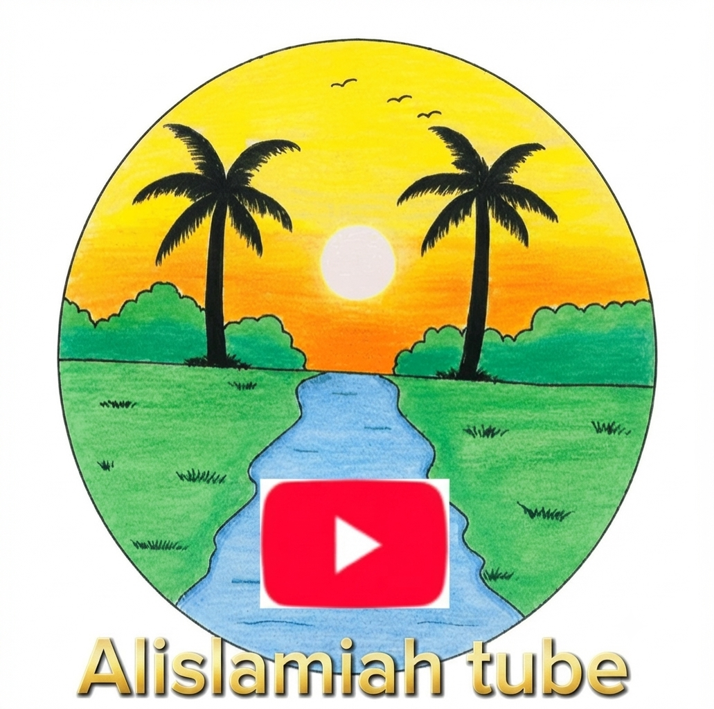

<!DOCTYPE html>
<html lang="ar" dir="rtl">
<head>
  <meta charset="UTF-8">
  <meta name="viewport" content="width=device-width, initial-scale=1.0">
  <title>Alislamiah-Tube</title>
  <link rel="icon" href="icon.png" type="image/png">
  <link href="https://googleapis.com" rel="stylesheet">
  
</head>
<body>
  <header class="header">
    
    <h1 id="header-title">Alislamiah-Tube</h1>
  </header>

  <main class="main-content">
    <h2 class="section-title" id="main-section-title">أحدث الفيديوهات</h2>
    

      
      <!-- فيديو 1 -->
      <a href="watch.html?v=IMG_20260814_164242_861.mp4&title=ما تيسر من سورة إبراهيم" class="video-card">
        

          <video preload="metadata" muted autoplay loop playsinline>
            <source src="IMG_20260814_164242_861.mp4" type="video/mp4">
          </video>
        

        

          
ما تيسر من سورة إبراهيم

          
Alislamiah-Tube

        

      </a>

      <!-- فيديو 2 -->
      <a href="watch.html?v=lv_0_20260824111719.mp4&title=آيات من سورة مريم بصوت مشاري راشد العفاسي" class="video-card">
        

          <video preload="metadata" muted autoplay loop playsinline>
            <source src="lv_0_20260824111719.mp4" type="video/mp4">
          </video>
        

        

          
آيات من سورة مريم بصوت مشاري راشد العفاسي

          
Alislamiah-Tube

        

      </a>

      <!-- فيديو 3: تم إرجاع فيديو بل الساعة موعدهم هنا بنجاح ✅ -->
      <a href="watch.html?v=IMG_20260812_142700_033.mp4&title=بل الساعة موعدهم والساعة أدهى وأمر تلاوة عطرة بصوت الشيخ مشاري العفاسي" class="video-card">
        

          <video preload="metadata" muted autoplay loop playsinline>
            <source src="IMG_20260812_142700_033.mp4" type="video/mp4">
          </video>
        

        

          
بل الساعة موعدهم والساعة أدهى وأمر تلاوة عطرة بصوت الشيخ مشاري العفاسي

          
Alislamiah-Tube

        

      </a>

      <!-- فيديو 4 -->
      <a href="watch.html?v=فرض الفصل الثالث سنة ثالثة متوسط في العلوم الفيزيائية (1).mp4&title=فرض الفصل الثالث سنة ثالثة متوسط في العلوم الفيزيائية (1)" class="video-card">
        

          <video preload="metadata" muted autoplay loop playsinline>
            <source src="فرض الفصل الثالث سنة ثالثة متوسط في العلوم الفيزيائية (1).mp4" type="video/mp4">
          </video>
        

        

          
فرض الفصل الثالث سنة ثالثة متوسط في العلوم الفيزيائية (1)

          
Alislamiah-Tube

        

      </a>

      <!-- فيديو 5 -->
      <a href="watch.html?v=فرض الفصل الثالث سنة ثالثة متوسط في العلوم الفيزيائية.mp4&title=فرض الفصل الثالث سنة ثالثة متوسط في العلوم الفيزيائية" class="video-card">
        

          <video preload="metadata" muted autoplay loop playsinline>
            <source src="فرض الفصل الثالث سنة ثالثة متوسط في العلوم الفيزيائية.mp4" type="video/mp4">
          </video>
        

        

          
فرض الفصل الثالث سنة ثالثة متوسط في العلوم الفيزيائية

          
Alislamiah-Tube

        

      </a>

      <!-- فيديو 6 -->
      <a href="watch.html?v=فرض الفصل الثالث في ماده العلوم الفيزيائيه السنه اولى متوسط.mp4&title=فرض الفصل الثالث في مادة العلوم الفيزيائية السنة الأولى متوسط" class="video-card">
        

          <video preload="metadata" muted autoplay loop playsinline>
            <source src="فرض الفصل الثالث في ماده العلوم الفيزيائيه السنه اولى متوسط.mp4" type="video/mp4">
          </video>
        

        

          
فرض الفصل الثالث في مادة العلوم الفيزيائية السنة الأولى متوسط

          
Alislamiah-Tube

        

      </a>

      <!-- فيديو 7 -->
      <a href="watch.html?v=نموذج مقترح فرض الفصل الثالث سنة ثالثة متوسط.mp4&title=نموذج مقترح فرض الفصل الثالث سنة ثالثة متوسط" class="video-card">
        

          <video preload="metadata" muted autoplay loop playsinline>
            <source src="نموذج مقترح فرض الفصل الثالث سنة ثالثة متوسط.mp4" type="video/mp4">
          </video>
        

        

          
نموذج مقترح فرض الفصل الثالث سنة ثالثة متوسط

          
Alislamiah-Tube

        

      </a>

      <!-- فيديو 8 -->
      <a href="watch.html?v=شرح درس الخطاب المباشر والغير مباشر مكتوب.mp4&title=شرح درس الخطاب المباشر والغير مباشر مكتوب" class="video-card">
        

          <video preload="metadata" muted autoplay loop playsinline>
            <source src="شرح درس الخطاب المباشر والغير مباشر مكتوب.mp4" type="video/mp4">
          </video>
        

        

          
شرح درس الخطاب المباشر والغير مباشر مكتوب

          
Alislamiah-Tube

        

      </a>

    

  </main>

  <nav class="bottom-nav">
    <a href="index.html" class="nav-item active">
      🏠
      الرئيسية
    </a>
    <a href="search.html" class="nav-item">
      🔍
      البحث
    </a>
    <a href="Settings.html" class="nav-item">
      ⚙️
      الإعدادات
    </a>
  </nav>

  
</body>
</html>
